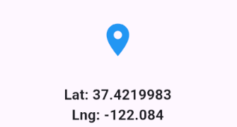
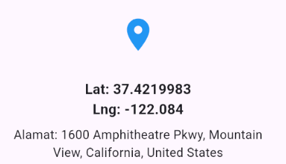
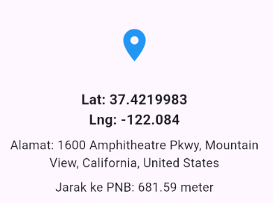

# Praktikum Flutter – Geolocator dan Geocoding
* Nama: Dino
* NIM: 362458302043
* Mata Kuliah: Praktikum Pemrograman Perangkat Bergerak
* Topik: Implementasi Geolocator dan Geocoding di Flutter
* File Utama: `main.dart`
* Bahasa Pemrograman: Dart (Flutter)

## 1. Latar Belakang

Pada praktikum ini, saya mempelajari cara membuat aplikasi Flutter yang memanfaatkan fitur lokasi.
Fitur berbasis lokasi sangat penting dalam pengembangan aplikasi mobile modern, seperti aplikasi peta, transportasi online, atau pelacak posisi pengguna.
Melalui praktikum ini, saya menggunakan **Geolocator** untuk mendapatkan koordinat latitude dan longitude, serta **Geocoding** untuk mengubah koordinat tersebut menjadi alamat yang dapat dibaca.
Selain itu, saya juga mengimplementasikan fitur untuk **mengukur jarak real-time** antara posisi saya dengan titik tetap tertentu.

---

## 2. Tujuan Praktikum

* Saya memahami cara menggunakan paket `geolocator` untuk mendapatkan lokasi pengguna.
* Saya mengimplementasikan paket `geocoding` untuk menampilkan alamat berdasarkan koordinat.
* Saya menghitung jarak antara posisi saya dengan titik tetap menggunakan fungsi `distanceBetween()`.
* Saya membuat tampilan antarmuka sederhana untuk menampilkan hasil koordinat, alamat, dan jarak secara real-time.

---

## 3. Kebutuhan dan Persiapan

### a. Software dan Tools

* Flutter SDK
* Android Studio atau VS Code
* Emulator Android atau perangkat fisik dengan GPS aktif

### b. Dependensi pada `pubspec.yaml`

Saya menambahkan dependensi berikut agar bisa menggunakan fitur lokasi dan geocoding.

```yaml
geolocator: ^14.0.2
geocoding: ^4.0.0
```

### c. Izin pada `AndroidManifest.xml`

Saya menambahkan izin berikut di
`android/app/src/main/AndroidManifest.xml`
agar aplikasi dapat mengakses lokasi perangkat.

```xml
<uses-permission android:name="android.permission.INTERNET"/>
<uses-permission android:name="android.permission.ACCESS_FINE_LOCATION"/>
<uses-permission android:name="android.permission.ACCESS_COARSE_LOCATION"/>
```

#### Penjelasan:

* `ACCESS_FINE_LOCATION` digunakan agar aplikasi bisa mendapatkan lokasi akurat dari GPS.
* `ACCESS_COARSE_LOCATION` digunakan untuk lokasi perkiraan berbasis jaringan.
* `INTERNET` diperlukan karena proses geocoding membutuhkan koneksi internet.

---

## 4. Langkah-Langkah Praktikum

### Langkah 1: Menampilkan Latitude dan Longitude

Pada tahap pertama, saya membuat fungsi untuk mendapatkan koordinat latitude dan longitude dari perangkat.

Langkah yang saya lakukan:

1. Saya mengimpor paket `geolocator`.
2. Saya membuat fungsi `_getPermissionAndLocation()` untuk memeriksa izin akses lokasi.
3. Saya memanggil fungsi tersebut untuk mendapatkan posisi pengguna, lalu menampilkannya di UI.

```dart
Future<Position> _getPermissionAndLocation() async {
  bool serviceEnabled = await Geolocator.isLocationServiceEnabled();
  if (!serviceEnabled) {
    return Future.error('Layanan lokasi tidak aktif. Harap aktifkan GPS.');
  }

  LocationPermission permission = await Geolocator.checkPermission();
  if (permission == LocationPermission.denied) {
    permission = await Geolocator.requestPermission();
    if (permission == LocationPermission.denied) {
      return Future.error('Izin lokasi ditolak.');
    }
  }

  if (permission == LocationPermission.deniedForever) {
    return Future.error('Izin lokasi ditolak permanen. Harap ubah di pengaturan.');
  }

  return await Geolocator.getCurrentPosition(
    desiredAccuracy: LocationAccuracy.high,
  );
}
```

Setelah fungsi ini dijalankan, aplikasi menampilkan koordinat latitude dan longitude dari posisi saya saat ini.



dari tampilan diatas, koordinatnya bukan ditempat saya melainkan di kantor google, dikarenakan saya menggunakan emulator dari android studio. Namun saya juga mencoba menjalankan di device fisik dan menampilkan hasil yang sesuai yakni ditempat saya mencobanya. Sehingga hal ini tidak menjadi masalah.

---

### Langkah 2: Menampilkan Alamat (Geocoding)

Pada tahap kedua, saya menambahkan fitur untuk menampilkan alamat berdasarkan koordinat yang saya dapatkan.

Langkah-langkah yang saya lakukan:

1. Saya menambahkan dependensi `geocoding` ke dalam proyek.
2. Saya mengimpor paket:

   ```dart
   import 'package:geocoding/geocoding.dart';
   ```
3. Saya membuat variabel untuk menyimpan alamat:

   ```dart
   String? _currentAddress;
   ```
4. Saya membuat fungsi baru untuk mengonversi koordinat menjadi alamat:

   ```dart
   void _getAddressFromLatLng(Position position) async {
     try {
       List<Placemark> placemarks = await placemarkFromCoordinates(
         position.latitude,
         position.longitude,
       );
       Placemark place = placemarks[0];
       setState(() {
         _currentAddress =
             "${place.street}, ${place.locality}, ${place.administrativeArea}, ${place.country}";
       });
     } catch (e) {
       setState(() {
         _errorMessage = "Gagal mendapatkan alamat: ${e.toString()}";
       });
     }
   }
   ```
5. Saya memanggil fungsi `_getAddressFromLatLng()` setelah lokasi berhasil diambil agar alamat langsung muncul di tampilan.

    ```dart
        _getAddressFromLatLng(position);
    ```
6. Saya menampilkan hasil currentAddress tersebut di UI.

    ```dart
    if (_currentAddress != null)
        Padding(
            padding: const EdgeInsets.only(top: 8.0),
            child: Text(
            "Alamat: $_currentAddress",
            textAlign: TextAlign.center,
            style: TextStyle(
                fontSize: 16,
            ),
        ),
    ),
    ```

Contoh hasil:



---

### Langkah 3: Mengukur Jarak ke Titik Tetap

Pada tahap terakhir, saya membuat fitur untuk menghitung jarak antara posisi saya dengan lokasi tetap.

Langkah yang saya lakukan:

1. Saya menentukan koordinat lokasi PNB.

   ```dart
   final double pnbLatitude = 37.42796133580664;
   final double pnbLongitude = -122.085749655962;
   ```
2. Saya membuat variabel untuk menyimpan hasil jarak.

   ```dart
   String? distanceToPNB;
   ```
3. Saya menggunakan fungsi `Geolocator.distanceBetween()` untuk menghitung jarak.

   ```dart
   double distanceInMeters = Geolocator.distanceBetween(
     position.latitude,
     position.longitude,
     pnbLatitude,
     pnbLongitude,
   );
   distanceToPNB = "${distanceInMeters.toStringAsFixed(2)} meter";
   ```
4. Saya menampilkan hasil jarak tersebut di UI agar dapat berubah secara real-time saat saya bergerak.

    ```dart
    if (distanceToPNB != null)
        Padding(
            padding: const EdgeInsets.only(top: 8.0),
            child: Text(
                "Jarak ke PNB: $distanceToPNB",
                textAlign: TextAlign.center,
                style: TextStyle(
                    fontSize: 16,
                ),
            ),
        ),
    ```
5. Contoh Hasil


---

## 5. Kode Lengkap

Seluruh implementasi praktikum ini saya tulis dalam file `main.dart`.

```dart
import 'dart:async';
import 'package:flutter/material.dart';
import 'package:geolocator/geolocator.dart';
import 'package:geocoding/geocoding.dart';

void main() {
  runApp(MyApp());
}

class MyApp extends StatelessWidget {
  @override
  Widget build(BuildContext context) {
    return MaterialApp(
      title: 'Praktikum Geolocator (Dasar)',
      theme: ThemeData(
        primarySwatch: Colors.blue,
        visualDensity: VisualDensity.adaptivePlatformDensity,
      ),
      debugShowCheckedModeBanner: false,
      home: MyHomePage(),
    );
  }
}

class MyHomePage extends StatefulWidget {
  @override
  _MyHomePageState createState() => _MyHomePageState();
}

class _MyHomePageState extends State<MyHomePage> {
  Position? _currentPosition;
  String? _errorMessage;
  StreamSubscription<Position>? _positionStream;
  String? _currentAddress;
  String? distanceToPNB;

  final double pnbLatitude = 37.42796133580664;
  final double pnbLongitude = -122.085749655962;

  @override
  void dispose() {
    _positionStream?.cancel();
    super.dispose();
  }

  Future<Position> _getPermissionAndLocation() async {
    bool serviceEnabled;
    LocationPermission permission;

    // 1. Cek apakah layanan lokasi (GPS) di perangkat aktif
    serviceEnabled = await Geolocator.isLocationServiceEnabled();
    if (!serviceEnabled) {
      // Jika tidak aktif, kirim error
      return Future.error('Layanan lokasi tidak aktif. Harap aktifkan GPS.');
    }

    // 2. Cek izin lokasi dari aplikasi
    permission = await Geolocator.checkPermission();
    if (permission == LocationPermission.denied) {
      // Jika ditolak, minta izin
      permission = await Geolocator.requestPermission();
      if (permission == LocationPermission.denied) {
        // Jika tetap ditolak, kirim error
        return Future.error('Izin lokasi ditolak.');
      }
    }

    if (permission == LocationPermission.deniedForever) {
      return Future.error(
        'Izin lokasi ditolak permanen. Harap ubah di pengaturan aplikasi.',
      );
    }

    return await Geolocator.getCurrentPosition(
      desiredAccuracy: LocationAccuracy.high,
    );
  }

  // --- FUNGSI AKSI (TOMBOL) ---

  /**
   * Aksi untuk tombol 'Dapatkan Lokasi Sekarang'.
   * Mengambil lokasi satu kali saja.
   */
  void _handleGetLocation() async {
    try {
      Position position = await _getPermissionAndLocation();
      setState(() {
        _currentPosition = position;
        _errorMessage = null;
      });

      _getAddressFromLatLng(position);
    } catch (e) {
      setState(() {
        _errorMessage = e.toString();
      });
    }
  }

  void _handleStartTracking() {
    _positionStream?.cancel();

    final LocationSettings locationSettings = LocationSettings(
      accuracy: LocationAccuracy.high,
      distanceFilter: 10,
    );

    try {
      _positionStream =
          Geolocator.getPositionStream(
            locationSettings: locationSettings,
          ).listen((Position position) {
            setState(() {
              _currentPosition = position;
              _errorMessage = null;

              double distanceInMeters = Geolocator.distanceBetween(
                position.latitude,
                position.longitude,
                pnbLatitude,
                pnbLongitude,
              );

              distanceToPNB = "${distanceInMeters.toStringAsFixed(2)} meter";
            });
            _getAddressFromLatLng(position);

          }, onError: (e) {
            setState(() {
              _errorMessage = e.toString();
          });
        });
    } catch (e) {
      setState(() {
        _errorMessage = e.toString();
      });
    }
  }

  void _handleStopTracking() {
    _positionStream?.cancel();
    setState(() {
      _errorMessage = "Pelacakan dihentikan.";
    });
  }

  void _getAddressFromLatLng(Position position) async {
    try {
      List<Placemark> placemarks = await placemarkFromCoordinates(
        position.latitude,
        position.longitude,
      );
      Placemark place = placemarks[0];
      setState(() {
        _currentAddress =
            "${place.street}, ${place.locality}, ${place.administrativeArea}, ${place.country}";
      });
    } catch (e) {
      setState(() {
        _errorMessage = "Gagal mendapatkan alamat: ${e.toString()}";
      });
    }
  }

  @override
  Widget build(BuildContext context) {
    return Scaffold(
      appBar: AppBar(title: Text("Praktikum Geolocator (Dasar)")),
      body: Center(
        child: Padding(
          padding: const EdgeInsets.all(24.0),
          child: SingleChildScrollView(
            child: Column(
              mainAxisAlignment: MainAxisAlignment.center,
              children: [
                Icon(Icons.location_on, size: 50, color: Colors.blue),
                SizedBox(height: 16),

                ConstrainedBox(
                  constraints: BoxConstraints(minHeight: 150),
                  child: Column(
                    mainAxisAlignment: MainAxisAlignment.center,
                    children: [
                      if (_errorMessage != null)
                        Text(
                          _errorMessage!,
                          style: TextStyle(color: Colors.red, fontSize: 16),
                          textAlign: TextAlign.center,
                        ),

                      SizedBox(height: 16),

                      if (_currentPosition != null)
                        Text(
                          "Lat: ${_currentPosition!.latitude}\nLng: ${_currentPosition!.longitude}",
                          textAlign: TextAlign.center,
                          style: TextStyle(
                            fontSize: 18,
                            fontWeight: FontWeight.bold,
                          ),
                        ),
                      if (_currentAddress != null)
                        Padding(
                          padding: const EdgeInsets.only(top: 8.0),
                          child: Text(
                            "Alamat: $_currentAddress",
                            textAlign: TextAlign.center,
                            style: TextStyle(
                              fontSize: 16,
                            ),
                          ),
                        ),
                      if (distanceToPNB != null)
                        Padding(
                          padding: const EdgeInsets.only(top: 8.0),
                          child: Text(
                            "Jarak ke PNB: $distanceToPNB",
                            textAlign: TextAlign.center,
                            style: TextStyle(
                              fontSize: 16,
                            ),
                          ),
                        ),
                    ],
                  ),
                ),

                SizedBox(height: 32),

                ElevatedButton.icon(
                  icon: Icon(Icons.location_searching),
                  label: Text('Dapatkan Lokasi Sekarang'),
                  onPressed: _handleGetLocation,
                  style: ElevatedButton.styleFrom(
                    minimumSize: Size(double.infinity, 40),
                  ),
                ),
                SizedBox(height: 16),
                Row(
                  mainAxisAlignment: MainAxisAlignment.spaceEvenly,
                  children: [
                    ElevatedButton.icon(
                      icon: Icon(Icons.play_arrow),
                      label: Text('Mulai Lacak'),
                      onPressed: _handleStartTracking,
                      style: ElevatedButton.styleFrom(
                        backgroundColor: Colors.green,
                      ),
                    ),
                    ElevatedButton.icon(
                      icon: Icon(Icons.stop),
                      label: Text('Henti Lacak'),
                      onPressed: _handleStopTracking,
                      style: ElevatedButton.styleFrom(
                        backgroundColor: Colors.red,
                      ),
                    ),
                  ],
                ),
              ],
            ),
          ),
        ),
      ),
    );
  }
}
```

Selain fungsi utama, di dalam `main.dart` juga terdapat fungsi untuk:

* Mendapatkan lokasi (`_handleGetLocation`)
```dart
  void _handleGetLocation() async {
    try {
      Position position = await _getPermissionAndLocation();
      setState(() {
        _currentPosition = position;
        _errorMessage = null;
      });

      _getAddressFromLatLng(position);
    } catch (e) {
      setState(() {
        _errorMessage = e.toString();
      });
    }
  }
```
* Melacak lokasi secara real-time (`_handleStartTracking`)
```dart
 void _handleStartTracking() {
    _positionStream?.cancel();

    final LocationSettings locationSettings = LocationSettings(
      accuracy: LocationAccuracy.high,
      distanceFilter: 10,
    );

    try {
      _positionStream =
          Geolocator.getPositionStream(
            locationSettings: locationSettings,
          ).listen((Position position) {
            setState(() {
              _currentPosition = position;
              _errorMessage = null;

              double distanceInMeters = Geolocator.distanceBetween(
                position.latitude,
                position.longitude,
                pnbLatitude,
                pnbLongitude,
              );

              distanceToPNB = "${distanceInMeters.toStringAsFixed(2)} meter";
            });
            _getAddressFromLatLng(position);

          }, onError: (e) {
            setState(() {
              _errorMessage = e.toString();
          });
        });
    } catch (e) {
      setState(() {
        _errorMessage = e.toString();
      });
    }
  }
```
* Menghentikan pelacakan (`_handleStopTracking`)
```dart
  void _handleStopTracking() {
    _positionStream?.cancel();
    setState(() {
      _errorMessage = "Pelacakan dihentikan.";
    });
  }

  void _getAddressFromLatLng(Position position) async {
    try {
      List<Placemark> placemarks = await placemarkFromCoordinates(
        position.latitude,
        position.longitude,
      );
      Placemark place = placemarks[0];
      setState(() {
        _currentAddress =
            "${place.street}, ${place.locality}, ${place.administrativeArea}, ${place.country}";
      });
    } catch (e) {
      setState(() {
        _errorMessage = "Gagal mendapatkan alamat: ${e.toString()}";
      });
    }
  }
```

---

## 6. Hasil Akhir

Setelah semua langkah selesai, aplikasi yang saya buat menampilkan:

* Koordinat (Latitude dan Longitude) dari posisi saya
* Alamat hasil geocoding dari koordinat tersebut
* Jarak antara posisi saya dan titik PNB
* Tiga tombol utama:

  * Dapatkan Lokasi Sekarang
  * Mulai Lacak
  * Henti Lacak

Contoh hasil tampilan:


---

## 7. Kesimpulan

Dari praktikum yang telah saya lakukan, saya berhasil menggunakan paket Geolocator untuk mengambil posisi pengguna secara akurat. Selain itu, saya juga menggunakan Geocoding untuk mengonversi koordinat menjadi alamat yang dapat dibaca manusia. Saya memanfaatkan fungsi `distanceBetween()` untuk menghitung jarak antara posisi saya dengan lokasi tetap. Dengan menggabungkan fitur-fitur tersebut, saya dapat membuat aplikasi pelacakan lokasi yang menampilkan koordinat, alamat, dan jarak secara dinamis. Saya juga memahami pentingnya pengaturan izin lokasi pada Android agar fitur lokasi dapat berfungsi dengan baik tanpa menimbulkan error.

---